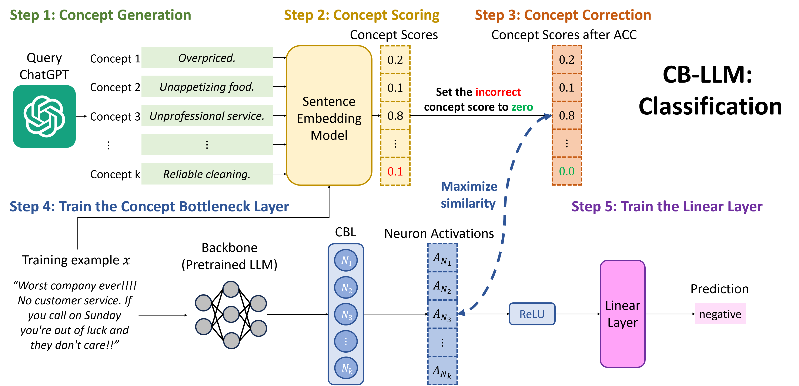
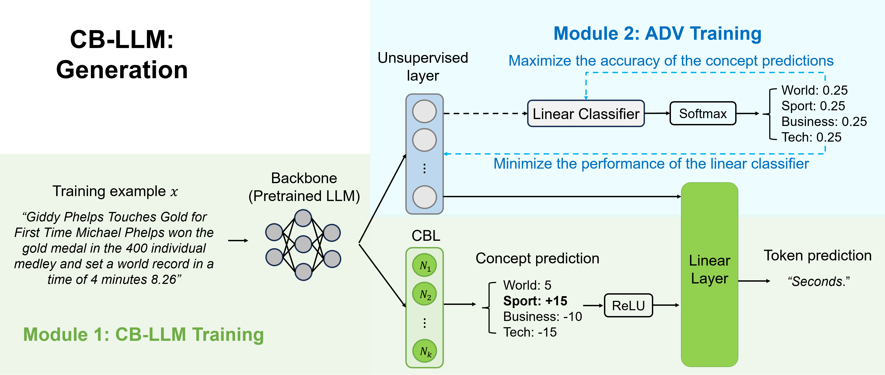

# Concept Bottleneck Large Language Models
This is the repo for the paper: [**Concept Bottleneck Large Language Models**](). We proposed Concept Bottleneck Large Language Model (CB-LLM), a groundbreaking framework for developing inherently interpretable Large Language Models (LLMs). CB-LLM extends and generalizes our earlier research, [**Crafting Large Language Models for Enhanced Interpretability**](https://arxiv.org/abs/2407.04307), offering both interpretability and controllability in text generation. The repo contains two parts: CB-LLM (classification) and CB-LLM (generation)

## Part I: CB-LLM (classification)
<p align="center">
  
</p>

### Setup
Recommend using cuda12.1, python3.10, pytorch2.2.
Go into the folder for classification case:
```
cd classification
```

Install the packages:
```
pip install -r requirements.txt
```
We also provide finetuned CB-LLMs, allowing you to skip the training process. Download the checkpoints from huggingface:
```
git lfs install
git clone https://huggingface.co/cesun/cbllm-classification temp_repo
mv temp_repo/mpnet_acs .
rm -rf temp_repo
```
### Training
#### Automatic Concept Scoring (ACS)
To generate the concept scores by our ACS strategy, run
```
python get_concept_labels.py
```
This will generate the concept scores for the SST2 dataset using our predefined concept set, and store the scores under `mpnet_acs/SetFit_sst2/`.
Set the argument `--dataset yelp_polarity`, `--dataset ag_news`, or `--dataset dbpedia_14` to switch the dataset.
#### Train CBL
To train the CBL, run
```
python train_CBL.py --automatic_concept_correction
```
This will train the CBL with Automatic Concept Correction for the SST2 dataset, and store the model under `mpnet_acs/SetFit_sst2/roberta_cbm/`.
To disable Automatic Concept Correction, remove the given argument.
Set the argument `--backbone gpt2` to switch the backbone from roberta to gpt2.
Set the argument `--dataset yelp_polarity`, `--dataset ag_news`, or `--dataset dbpedia_14` to switch the dataset.
#### Train the final predictor
To train the final predictor, run
```
python train_FL.py --cbl_path mpnet_acs/SetFit_sst2/roberta_cbm/cbl_acc.pt
```
This will train the linear predictor of the CBL for the SST2 dataset, and store the linear layer in the same directory.
Please change the argument `--cbl_path` accordingly if using other settings.
#### Train the baseline black-box model
To train the baseline standard black-box model, run
```
python finetune_black_box.py
```
This will train the black-box (non-interpretable) model for the SST2 dataset, and store the model under `baseline_models/roberta/`.
Set the argument `--backbone gpt2` to switch the backbone from roberta to gpt2.
Set the argument `--dataset yelp_polarity`, `--dataset ag_news`, or `--dataset dbpedia_14` to switch the dataset.
### Testing
#### Test CB-LLM (classification)
To test the accuracy of the CB-LLM, run
```
python test_CBLLM.py --cbl_path mpnet_acs/SetFit_sst2/roberta_cbm/cbl_acc.pt
```
Please change the argument `--cbl_path` accordingly if using other settings.
#### Generate explanations from CB-LLM
To visualize the neurons in CB-LLM (task 1 in our paper), run
```
python print_concept_activations.py --cbl_path mpnet_acs/SetFit_sst2/roberta_cbm/cbl_acc.pt
```
This will generate 5 most related samples for each neuron explanation.
Please change the argument `--cbl_path` accordingly if using other settings.

To get the explanations provided by CB-LLM (task 2 in our paper), run
```
python print_concept_contributions.py --cbl_path mpnet_acs/SetFit_sst2/roberta_cbm/cbl_acc.pt
```
This will generate 5 explanations for each sample in the dataset.
Please change the argument `--cbl_path` accordingly if using other settings.
#### Test the baseline black-box model
To test the accuracy of the baseline standard black-box model, run
```
python test_black_box.py --model_path baseline_models/roberta/backbone_finetuned_sst2.pt
```
Set the argument `--dataset yelp_polarity`, `--dataset ag_news`, or `--dataset dbpedia_14` to switch the dataset.
Please change the argument `--model_path` accordingly if using other settings.

## Part II: CB-LLM (generation)
<p align="center">
  
</p>

### Setup
Recommend using cuda12.1, python3.10, pytorch2.2.
Go into the folder for generation case:
```
cd generation
```
Install the packages:
```
pip install -r requirements.txt
```
We also provide finetuned CB-LLMs, allowing you to skip the training process. Download the checkpoints from huggingface:
```
git lfs install
git clone https://huggingface.co/cesun/cbllm-generation temp_repo
mv temp_repo/from_pretained_llama3_lora_cbm .
rm -rf temp_repo
```
### Training
#### Train CB-LLM (generation)
To train the CB-LLM for text generation, run
```
python train_CBLLM.py
```
This will train the CB-LLM (Lora finetune Llama3 with CBL) on SST2 dataset with the class labels as concepts (negative or positive), and store the model under `from_pretained_llama3_lora_cbm/SetFit_sst2/`.
Set the argument `--dataset yelp_polarity`, `--dataset ag_news`, or `--dataset dbpedia_14` to switch the dataset.
### Testing
#### Test the concept detection of CB-LLM (generation)
To test the concept detection (concept accuracy) of the CB-LLM, run
```
python test_concepts.py
```
Please rename the desired checkpoint of the peft model and CBL as `llama3` and `cbl.pt`, as the script recognizes these file names.
Set the argument `--dataset yelp_polarity`, `--dataset ag_news`, or `--dataset dbpedia_14` to switch the dataset.
#### Test the steerability of CB-LLM (generation)
To test the steerability (concept accuracy) of the CB-LLM, need t first train the roberta classifier
```
python train_classifier.py
```
Set the argument `--dataset yelp_polarity`, `--dataset ag_news`, or `--dataset dbpedia_14` to switch the dataset.
After getting the classifier corresponding to the dataset, evaluate the steerability by running
```
python test_steerability.py
```
Please rename the desired checkpoint of the peft model and CBL as `llama3` and `cbl.pt`, as the script recognizes these file names.
#### Test the perplexity of the generated sentences from CB-LLM
To test the perplexity using Llama3-8B, run
```
python test_perplexity.py
```
Please rename the desired checkpoint of the peft model and CBL as `llama3` and `cbl.pt`, as the script recognizes these file names.
Set the argument `--dataset yelp_polarity`, `--dataset ag_news`, or `--dataset dbpedia_14` to switch the dataset.
#### Visualize the top 10 tokens with the highest weight connect to a concept neuron
Run
```
python test_weight.py
```
Set the argument `--dataset yelp_polarity`, `--dataset ag_news`, or `--dataset dbpedia_14` to switch the dataset.
#### Intervene the concept neurons and generate a sentence using CB-LLM
Run
```
python test_generation.py
```
By changing the activation value of the corresponding neuron in Line 48, the generation would contain the desired concepts.
Set the argument `--dataset yelp_polarity`, `--dataset ag_news`, or `--dataset dbpedia_14` to switch the dataset.
## Cite this work
Chung-En Sun, Tuomas Oikarinen, Tsui-Wei Weng. "Crafting Large Language Models for Enhanced Interpretability". arXiv preprint, 2024
```
@article{cbllm,
   title={Concept Bottleneck Large Language Models},
   author={Chung-En Sun, Tuomas Oikarinen, Berk Ustun, Tsui-Wei Weng},
   journal={arXiv 2024},
   year={2024}
}
```
